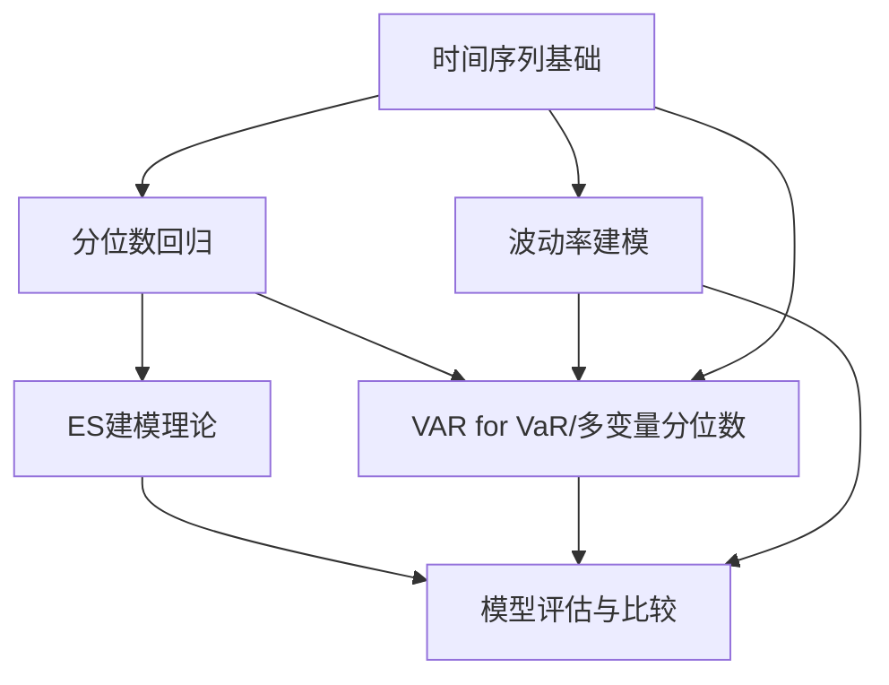
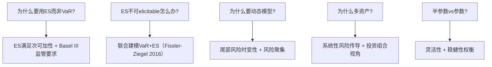

# 数理理论框架知识库

> **研究课题**: 多资产预期亏损(ES)的时间序列建模
> **聚焦方向**: 方法论构建合理性
> **深度级别**: 深入级（含文献关联）
> **文献源**: Zotero "VAR for ES" 文库

## 领域总览

```
00-计量理论/
├── 01-时间序列基础/       → 时间序列分析基础理论
├── 02-波动率建模/         → 波动率模型及其方法论基础
├── 03-分位数回归/         → 分位数回归与VaR建模
├── 04-ES建模/             → ES建模理论（核心领域）
├── 05-多变量时间序列/     → 多变量时间序列方法
└── 06-风险度量评估/       → 模型评估与比较
```

## 知识依赖图



## 方法论合理性决策树



## 知识条目列表

### 00-计量理论

| 编号 | 条目名称 | 类型 | 难度 | 核心问题 |
|------|---------|------|------|---------|
| 01 | 风险度量选择：VaR与ES的方法论比较 | concept | 2 | 为什么选择ES？ |
| 02 | ES的Elicitability问题与联合建模框架 | theorem | 4 | ES不可直接预测怎么办？ |
| 03 | 动态风险度量模型的理论依据 | method | 3 | 为什么需要动态模型？ |
| 04 | 半参数ES建模方法及其合理性 | method | 4 | 为什么选择半参数方法？ |
| 05 | CAViaR模型与动态分位数检验 | method | 4 | 如何直接建模并诊断分位数模型？ |
| 06 | GARCH+EVT两步法ES估计 | method | 4 | 极值理论如何改进ES估计？ |
| 07 | 非对称最小二乘与Expectile回归 | method | 4 | 有没有coherent+elicitable的统一方案？ |
| 08 | GAS框架与参数驱动模型的方法论比较 | method | 4 | 为什么选择GAS驱动动态结构？ |
| 09 | 多变量分位数回归与VAR for VaR | method | 4 | 如何建模多资产尾部风险？ |
| 10 | CoVaR与系统性风险度量 | method | 4 | 尾部风险如何跨机构传导？ |
| 11 | 风险度量回测与模型比较 | method | 3 | 如何验证模型合理性？ |
| 12 | 比较回测框架与三区域方法 | method | 4 | 如何在多个ES模型中择优？ |
| 13 | 广义脉冲响应在尾部风险分析中的应用 | method | 4 | 如何分析风险传导？ |
| 14 | 评分函数与模型选择 | concept | 3 | 用什么标准比较模型？ |
| 15 | 多变量GARCH模型方法论 | framework | 4 | 多变量波动率建模选择 |
| 16 | 时间序列基础概念 | concept | 1 | 时间序列分析的前提 |
